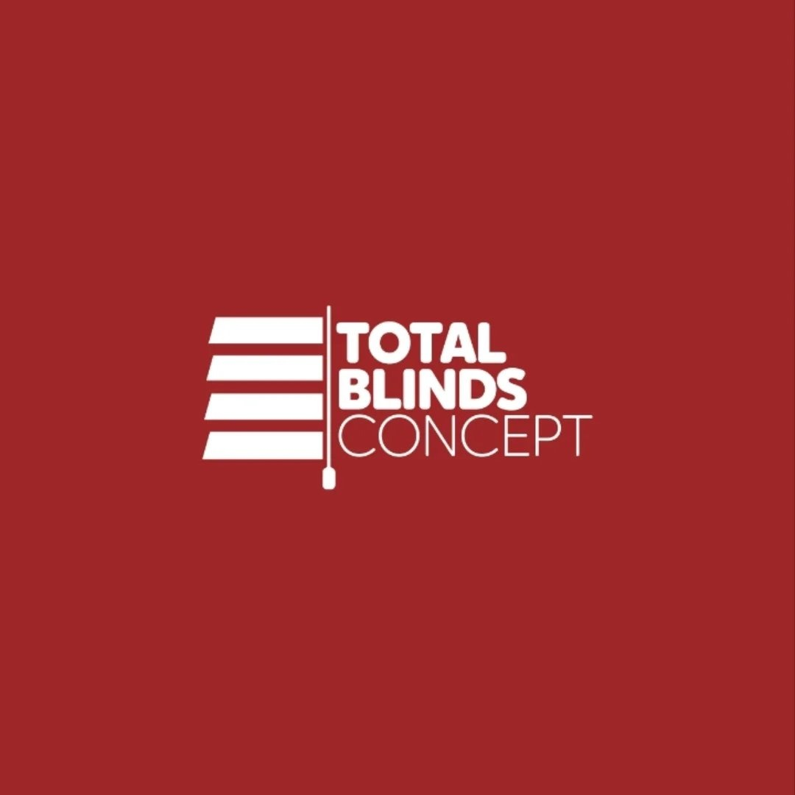

# DAMOLA DOYIN FELIX

## Website Developer • Digital Experience Designer • Growth Strategist

---

# ABOUT

Damola Doyin Felix is a Website Developer, Digital Experience Designer, and Growth Strategist passionate about helping businesses build powerful digital experiences that drive growth, engagement, and measurable business results.

With a unique combination of website development, digital marketing, conversion optimization, and business strategy, Damola creates websites that go beyond aesthetics to become valuable business assets.

His approach combines user experience, modern web technologies, brand storytelling, and performance-focused design to create websites that attract visitors, build trust, and convert prospects into customers.

Damola believes that websites should do more than simply exist online.

They should communicate value, tell compelling stories, and support business growth.

> "I don't build websites. I build digital experiences that drive business growth."

---

# PROFESSIONAL IDENTITY

### Primary Role

Website Developer

### Secondary Role

Digital Experience Designer

### Third Role

Growth Strategist

### Specialization

* Website Design & Development
* WordPress Development
* Elementor Development
* Conversion-Focused Websites
* UX & UI Design
* Landing Page Design
* Website Strategy
* Brand Storytelling
* SEO Optimization
* Website Performance Optimization
* Digital Growth Systems

---

# MISSION

To help ambitious businesses transform their online presence through high-performing websites, strategic design, and exceptional digital experiences.

---

# VISION

To become one of Africa's leading Digital Experience Designers and Growth Strategists, building websites and digital platforms that create measurable business impact.

---

# CORE EXPERTISE

## Website Development

* WordPress Development
* Elementor Pro Development
* Responsive Website Design
* Custom Website Builds
* Landing Page Development
* Corporate Websites
* Portfolio Websites
* Business Websites
* E-commerce Websites

---

## User Experience

* Information Architecture
* User Journey Mapping
* Conversion Optimization
* Website Audits
* Website Redesign Strategy
* Customer Experience Design

---

## Digital Growth

* SEO Strategy
* Conversion Rate Optimization (CRO)
* Lead Generation Systems
* Analytics Implementation
* Performance Marketing Integration
* Growth-Focused Website Strategy

---

## Technical Skills

* WordPress
* Elementor
* WooCommerce
* Shopify
* HTML
* CSS
* JavaScript
* Google Analytics 4
* Google Tag Manager
* Search Console
* Cloudflare
* Performance Optimization Tools

---

# WORK PHILOSOPHY

Most developers build websites.

Damola builds business assets.

Most developers focus on launch day.

Damola focuses on what happens after launch.

Most developers deliver pages.

Damola delivers digital experiences that help businesses grow.

---

# BRANDS & PROJECTS

## COMPLETED PROJECTS

### RJ4

Website:
https://www.rjfour.com/
<video controls src="Assets/completed-projects/Rj4 website.mp4" title="Title"></video>

Industry:
Luxury Lifestyle & E-Commerce

Project Overview:

RJ4 is a premium lifestyle brand offering fragrances, beauty products, fashion items, home fragrances, and luxury essentials.

Damola developed the website to create a sophisticated shopping experience that reflects the elegance and quality of the RJ4 brand.

Key Contributions:

* Website Development
* User Experience Design
* E-Commerce Optimization
* Mobile Responsiveness
* Conversion-Focused Structure

---

### CampusShelf

Website:
https://www.campus-shelf.com/
<video controls src="Assets/completed-projects/campusshelf website.mp4" title="Title"></video>

Industry:
Education Technology

Project Overview:

CampusShelf is a student-focused marketplace designed to help university students buy, sell, and exchange textbooks and academic materials.

The platform was built to create a trusted ecosystem that simplifies access to educational resources.

Key Contributions:

* Website Development
* Product Strategy
* Marketplace Experience Design
* User Experience Optimization
* Growth-Oriented Architecture

---

# CURRENT PROJECTS

## Total Blinds Concept

Website:
https://totalblindsconcept.com/
<video controls src="Assets/current-projects/total blinds website.mp4" title="Title"></video>

Industry:
Interior Design & Window Treatment

Project Overview:

A premium website redesign focused on showcasing window treatment solutions, interior transformation projects, and custom installations.

Key Contributions:

* Website Strategy
* Website Redesign
* Lead Generation Optimization
* User Experience Design
* Conversion Optimization

Status:
In Development

---

## RJ4 MedSpa

Website:
https://medspa.rjfour.com/
<video controls src="Assets/current-projects/Rj4 MedSpa we.mp4" title="Title"></video>

Industry:
Beauty, Wellness & Aesthetics

Project Overview:

A luxury digital platform designed to position RJ4 MedSpa as a premium destination for wellness, skincare, and aesthetic services.

Key Contributions:

* Website Design
* Service Presentation Strategy
* Conversion Optimization
* User Experience Design
* Brand Positioning

Status:
In Development

---

## Interior Specifics

Website:
https://interiorspecifics.com/

Industry:
Interior Design

<video controls src="Assets/current-projects/Interior Specifics.mp4" title="Title"></video>

Project Overview:

A premium interior design website focused on showcasing expertise, projects, and design solutions while generating qualified leads.

Key Contributions:

* Website Strategy
* Information Architecture
* User Experience Design
* Lead Generation Strategy
* Conversion Optimization

Status:
In Development

---

Skirttique

Website:

https://skirttique.com

<video controls src="Assets/current-projects/Skirttique website.mp4" title="
"></video>

Industry:

Luxury Fashion / Modest Fashion

Project Overview

A premium fashion e-commerce brand focused exclusively on custom-made midi and maxi skirts, designed for modern women who value elegance, modesty, versatility, and timeless style.

Skirttique positions itself as a global luxury skirt house, redefining skirts from simple wardrobe pieces into refined fashion essentials that transition seamlessly across professional, social, and personal lifestyles.

Key Contributions
Brand Strategy
Luxury Brand Positioning
Information Architecture
User Experience Design
E-Commerce Strategy
Conversion Optimization
Visual Identity Development
Content & Storytelling Strategy
Customer Journey Mapping
Performance Marketing Strategy

Status:

In Development

# INDUSTRIES SERVED

* Luxury & Lifestyle
* Interior Design
* Healthcare & Wellness
* Education
* E-Commerce
* Professional Services
* Small & Medium Businesses

# WHY CLIENTS WORK WITH DAMOLA

### Strategic Thinking

Every website begins with understanding business goals, not design trends.

### Growth-Focused Development

Websites are designed to generate leads, sales, and measurable business outcomes.

### User Experience Excellence

Every interaction is designed to guide visitors toward action.

### Modern Technology

Built with current best practices for speed, responsiveness, and scalability.

### Long-Term Value

The focus is not just on launching websites but on helping businesses grow.

---

# PERSONAL BRAND STATEMENT

Damola Doyin is a Website Developer, Digital Experience Designer, and Growth Strategist who helps businesses transform their online presence through high-performing websites, compelling digital experiences, and growth-focused design.

Combining technology, design, strategy, and marketing, he creates digital experiences that strengthen brands, improve customer engagement, and drive business growth.

---

# PERSONAL MOTTO

"Great websites don't just look beautiful.

They create experiences.

They build trust.

They drive growth."

---

# FUTURE DIRECTION

Damola's long-term vision extends beyond website development.

His ambition is to build digital products, platforms, and growth systems that help businesses across Africa leverage technology to scale, compete, and thrive in the digital economy.

Areas of Interest:

* Digital Experiences
* SaaS Products
* Growth Systems
* Business Automation
* Trust Infrastructure
* Conversion Optimization
* Product Development

---

# CONTACT

Available For:

* Website Development
* Website Redesign Projects
* WordPress Development
* Digital Experience Design
* Growth Strategy Consulting
* Conversion Optimization Projects
* Long-Term Digital Partnerships

Location:
Lagos, Nigeria

Name:
Damola Doyin Felix

Professional Identity:
Website Developer • Digital Experience Designer • Growth Strategist
